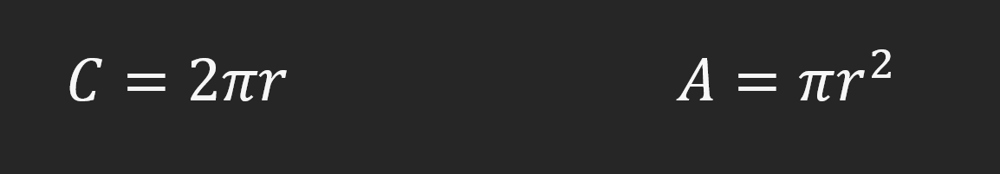

# 1-5 Exercise 1

### The assignment
Edit the file named "student.py". Create a program that takes in the radius and calculates the area and circumference of the triangle. You may use Math.PI or 3.14 for pi.  
Use the formulats provided.  

#### Input  
5  
  
#### Output  
31.4  
78.5  
  
## Check your work
Select the "Actions" tab on GitHub and select your latest commit. This will show you if your exercise passes all test cases.
